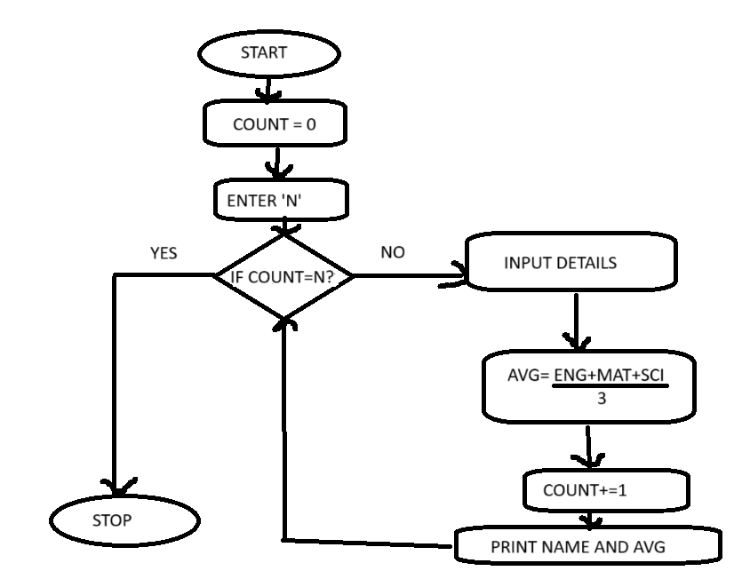

# Problem Solving Technique

## Linear 🔗

- Array
- Stack
- Linked list
- Queue

## Non-Linear 🌳

- Graph
- Tree
    - Binary Search Tree
    - AVL Tree
        - RR
        - LL
        - RL
        - LR

> Balance Factor = Height of (left)- Height of (right)

```python
x= a+b
```

## Shortcuts ⌨️

- `Alt + (Up/down)` - Move up/down
- `Ctrl + /` - comment
- `Ctrl + Shift + P` - VScode command pallet



## Stakeholders

People who are responsible for the product or the one who shares the risk of the product

## SCRUM

`Story points` - No. of days or hours used in a sprint meet for a team to finish their work.

`Planning` - Usually takes between 1-2 hrs

`Standup meeting` - Only held for 15 min(not more than 15 min) within a team in which they discuss about what happened since last meet and the blockers they faced.

`Sprint Review` - Every team will be present in this review

`Sprint Retro` - 

`Burn down char` - 

`Adhoc` - Requirement of sudden chage